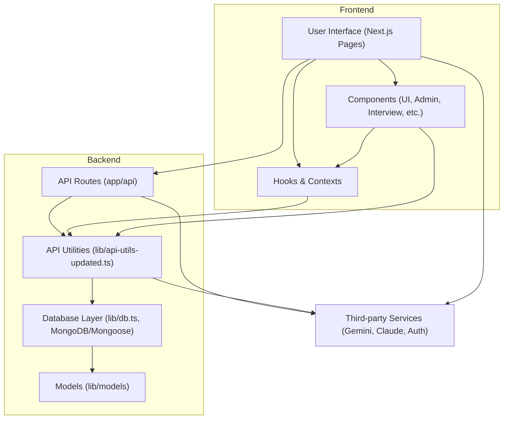

# 🚀 Calo Interview Platform


A modern, full-stack interview management and analytics platform. Built with Next.js, MongoDB, and advanced AI integrations (Gemini, Claude). Designed for scalability, extensibility, and beautiful user experience.

---

## 🌐 Architecture Overview



---

## 📋 Table of Contents

- [Features](#features)
- [Architecture Overview](#architecture-overview)
- [UI & Components](#ui--components)
- [API & Utilities](#api--utilities)
- [Database & Models](#database--models)
- [Hooks & Contexts](#hooks--contexts)
- [Third-party Integrations](#third-party-integrations)
- [Setup](#setup)
- [Usage](#usage)
- [Contributing](#contributing)
- [FAQ](#faq)
- [Support](#support)

---

## ✨ Features

- 🧑‍💼 Admin dashboard for interview management
- 📊 Real-time analytics and reporting
- 🤖 AI-powered question generation (Gemini, Claude)
- 🔒 Secure authentication (NextAuth, 2FA)
- 🗂️ Question banks and export/import
- 📝 Candidate management
- 📅 Scheduling and live interviews
- 🌈 Responsive, modern UI

---

## 🖥️ UI & Components

- Built with Next.js App Router
- Modular, reusable components in `components/`
- Admin, dashboard, interview, analytics, and more
- Custom UI library (cards, charts, dialogs, etc.)

## 🛠️ API & Utilities

- RESTful API routes in `app/api/`
- Unified API utilities in `lib/api-utils-updated.ts`
- Handles authentication, error handling, and retries
- Supports both mock and real data

## 🗄️ Database & Models

- MongoDB with Mongoose models in `lib/models/`
- Mock database for development in `lib/db.ts`
- Interview, User, Candidate, Question, Message, SystemLog schemas

## 🪝 Hooks & Contexts

- Custom React hooks for media queries, performance, toasts
- Session and auth context providers

## 🔗 Third-party Integrations

- Gemini & Claude AI APIs (unified key support)
- NextAuth for authentication
- AOS for animations
- Recharts for data visualization

---

## ⚡ Setup

1. **Clone the repo:**
   ```sh
   git clone https://github.com/your-org/calo.git
   cd calo
   ```
2. **Install dependencies:**
   ```sh
   npm install
   ```
3. **Configure environment:**
   - Copy `.env.example` to `.env.local` and fill in your secrets (MongoDB URI, API keys, etc.)
4. **Run the app:**
   ```sh
   npm run dev
   ```
5. **Build for production:**
   ```sh
   npm run build && npm start
   ```

---

## 🚀 Usage

- Access the dashboard at `http://localhost:3000/dashboard`
- Admin features at `/admin`
- Analytics at `/dashboard/analytics` and `/dashboard/real-analytics`
- Register/login to use full features

---

## 🤝 Contributing

1. Fork the repo
2. Create a feature branch (`git checkout -b feature/your-feature`)
3. Commit your changes
4. Push and open a PR
5. Follow the code style and add tests where possible

---

## ❓ FAQ

**Q: Can I use this with my own AI API keys?**
A: Yes! Set your Gemini/Claude API key in `.env.local`.

**Q: Is there a demo mode?**
A: Yes, mock data is used when not authenticated.

**Q: How do I add new question types?**
A: Extend the models and update the UI components.

---

## 🆘 Support

- Open an issue on GitHub
- Contact the maintainers via email (see `package.json`)

---

> Made with ❤️ by the Calo Team
